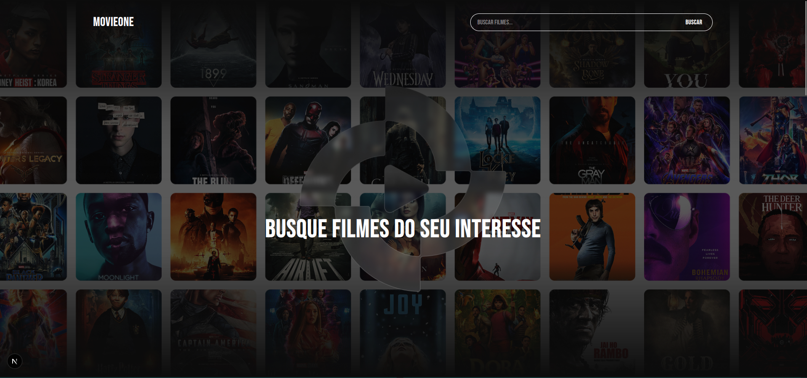
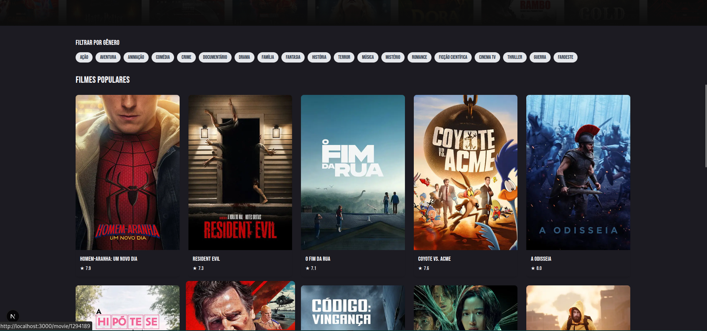
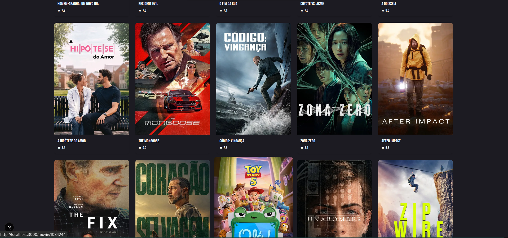

# 🎬 MovieOne

MovieOne é uma aplicação web desenvolvida com **Next.js**, **TypeScript** e **Tailwind CSS** que permite buscar, explorar e visualizar detalhes de filmes utilizando a API do TMDb. Ideal para cinéfilos que querem descobrir novos títulos e acompanhar o que já assistiram.

---

## 🚀 Funcionalidades

- 🔍 **Busca de filmes por nome**
- 🎭 **Filtragem por gênero**
- 📃 **Página de detalhes do filme**
- ♾️ **Scroll infinito**
- 🎨 **Design responsivo e moderno**
- 🌓 **Modo escuro (Dark Mode)**
- 🧭 **Navegação fluída entre páginas**
- ⚠️ **Mensagens de erro e carregamento**

---

## 🖼️ Preview







---

## 🛠️ Tecnologias Utilizadas

- [Next.js](https://nextjs.org/) – Framework React para SSR e SSG
- [TypeScript](https://www.typescriptlang.org/) – Tipagem estática para JS
- [Tailwind CSS](https://tailwindcss.com/) – Utilitários de CSS
- [Axios](https://axios-http.com/) – Requisições HTTP
- [TMDb API](https://www.themoviedb.org/documentation/api) – Fonte de dados dos filmes

---

## 📦 Instalação

1. Clone o repositório:

```bash
git clone https://github.com/iamdaviddev/movie-one.git
cd movie-one
```
2. Instale as dependências

```bash
npm install
```
3. Inicie o servidor

```bash
npm run dev
```

### Desenvolvido por Gerson Ndombaxi
